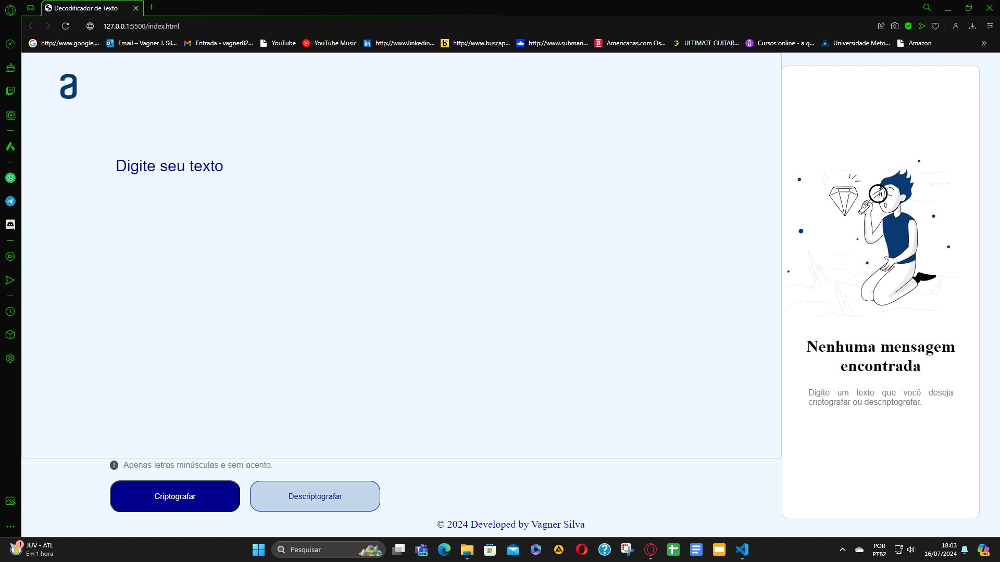
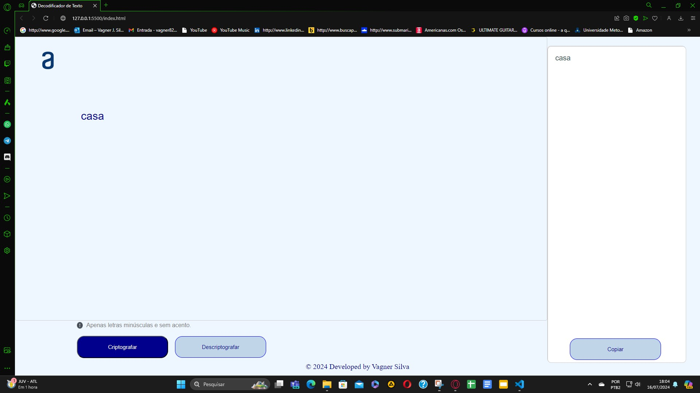

# 🔐 Decodificador de Textos

Bem-vindo ao **Decodificador de Textos**! Este projeto foi desenvolvido como parte do desafio do Oracle Next Education. 🚀

## 📜 Descrição

Este é um aplicativo web que criptografa e descriptografa textos utilizando uma chave específica. As regras de criptografia são as seguintes:
- 'e' é convertido para 'enter'
- 'i' é convertido para 'imes'
- 'a' é convertido para 'ai'
- 'o' é convertido para 'ober'
- 'u' é convertido para 'ufat'

## 🛠️ Tecnologias Utilizadas

- **HTML**
- **CSS**
- **JavaScript**

## 🚀 Sobre o Challenge

Este projeto foi desenvolvido como parte de um challenge do **Oracle Next Education**. O objetivo é criar uma aplicação que permita criptografar e descriptografar textos com as regras fornecidas.

## 👨‍💻 Time

  <strong>Desenvolvedor:</strong> [VagnerJ-ADS](https://github.com/VagnerJ-ADS)
   
  

## 🖼️ Imagens do Código em Funcionamento

Aqui estão algumas imagens das telas do decodificador:

## 📝 Como Utilizar

1. Clone este repositório.
2. Abra o arquivo `index.html` no seu navegador.
3. Insira o texto que deseja criptografar ou descriptografar.
4. Clique no botão correspondente para ver o resultado.

---

✨ **Divirta-se decodificando!** ✨
